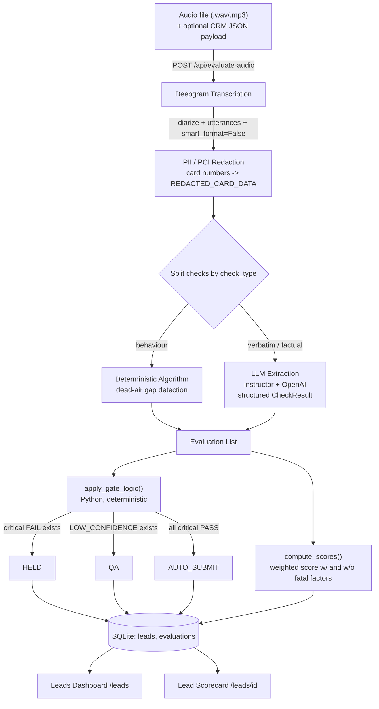

# Deterministic QA: AI-Powered Gate Logic
### High-Level Design (HLD)

## 1. System Overview

**Deterministic QA** is an automated CRM compliance engine for sales call centers. It ingests either a raw **call recording (audio)** or a **structured JSON transcript + CRM payload**, and grades the call against a retailer's compliance check library.

The system's core design principle is **deterministic-first, LLM-last**: every routing decision (`AUTO_SUBMIT`, `QA`, `HELD`) is made by explicit, auditable Python logic — never by an LLM. The LLM is used *only* to extract a structured verdict (`PASS` / `FAIL` / `LOW_CONFIDENCE`) per check from unstructured transcript text; it never decides what happens to the lead as a result.

This distinction matters for compliance: a human auditor can always answer *"why was this call HELD?"* with a concrete rule (`critical check X failed`), not a black-box LLM opinion.

## 2. Core Components

### Frontend UI
Vanilla JS + Tailwind CSS (CDN), server-rendered via Jinja2 — no build step, no SPA framework.

- **Leads dashboard** (`/leads`): a searchable, filterable list of evaluated calls with Chart.js summary charts and **status-based routing tabs** (`All`, `Auto-Submit (Pass)`, `Manual QA Queue`, `Held / Escalated`) that combine text search with a `data-status` filter client-side.
- **Lead scorecard** (`/leads/{lead_id}`): per-check pass/fail/low-confidence cards with transcript quotes, timestamps, an escalation/overturn action panel, and check-version traceability badges. Card-number sequences in the transcript are rendered as a masked, tooltip-labeled redaction badge rather than raw digits.
- **Live evaluation demo** (`/evaluate`): drag-and-drop audio upload with an **animated sequential pipeline loader** (Ingestion → AI Verification → Auto-Routing) that reflects real request lifecycle state, an abortable **Stop** control wired to a real `AbortController`, and toggles for engine parameters (STT model, LLM fallback) that are wired to real backend `Form` fields — not decorative.

### Backend Engine
Python (FastAPI + Uvicorn), fully async, backed by SQLite (`aiosqlite`).

Responsible for:
- Request ingestion (`multipart/form-data` audio+CRM, or JSON transcript payloads)
- Routing active checks by `check_type` (`verbatim`, `factual`, `behaviour`) to the correct evaluation path
- Deterministic gate logic and weighted scoring (see §3)
- Persistence of leads, evaluations, and manual overturns
- Serving the Jinja2-rendered dashboard/scorecard/demo pages

Key routes:

| Method | Path | Purpose |
|---|---|---|
| `POST` | `/api/evaluate-audio` | Demo path: audio upload → Deepgram transcription → evaluation |
| `POST` | `/api/leads/{lead_id}/process` | Evaluate a lead from an existing JSON transcript |
| `GET`  | `/api/leads/{lead_id}` | Fetch a lead's full evaluation bundle |
| `POST` | `/api/evaluations/{evaluation_id}/override` | Human QA override of a single check result |
| `POST` | `/api/leads/{lead_id}/overturn/{check_id}` | Overturn/escalation action on a check |
| `GET`  | `/api/dashboard/stats` | Aggregate stats for the dashboard charts |
| `GET`  | `/leads`, `/leads/{lead_id}`, `/evaluate` | Server-rendered UI pages |

### Transcription Service
[Deepgram](https://deepgram.com) (`deepgram-sdk`), called via `client.listen.v1.media.transcribe_file(...)` with:

- `diarize=True` — separates agent vs. customer speaker turns
- `utterances=True` — segments transcript into timestamped utterances (required for dead-air gap detection and per-quote timestamps in the scorecard)
- `smart_format=False` — preserves raw spoken-digit formatting rather than auto-formatting numbers, so downstream PCI redaction (regex-based, 13–16 digit runs) reliably matches card numbers before they're ever stored or shown to the LLM
- `model` — whitelisted to `nova-3` (current default) or `nova-2` (legacy fallback), selectable per request

### Evaluation Engine
A hybrid deterministic + LLM engine (`evaluator.py`), scoring transcripts against a retailer-specific JSON check library (e.g. `check_library_retailer_1.json`). Each check declares `check_type`, `is_critical`, `weight`, and (for verbatim checks) an exact `script_text`.

- **Type A — Verbatim** (e.g. recording disclaimer, DMO statement): judged by an LLM (via `instructor` + OpenAI, `response_model=CheckResultBatch`) against the *exact* `script_text` — no paraphrasing credit.
- **Type B — Factual** (e.g. rate quoted, email captured, account holder confirmed): LLM-judged against the CRM payload; auto-`PASS`-assumed only when no CRM payload is supplied (nothing to contradict).
- **Type C — Behaviour** (e.g. dead air > 10s): pure algorithmic detection over transcript timestamps — no LLM call, never blocks the sale (non-critical, coaching-only).

Every check result carries a `status`, an exact `transcript_quote`, and a `timestamp` — the system never accepts an unattributed pass.

**Safety fallbacks** (never a silent auto-pass):
- No `OPENAI_API_KEY` configured → routes to `LOW_CONFIDENCE` for human QA.
- LLM/schema error during evaluation → routes to `LOW_CONFIDENCE`, never assumed `PASS`.
- Operator disables "LLM Fallback Logic" → same `LOW_CONFIDENCE` routing, by design.

## 3. Data Flow

**Step-by-step:**
1. **Upload** — operator drops an audio file (+ optional CRM JSON, lead name, engine-parameter toggles) into the `/evaluate` UI.
2. **Transcription** — Deepgram returns a diarized, timestamped, speaker-attributed transcript.
3. **Redaction** — card-number-shaped digit runs are stripped and replaced with `[REDACTED_CARD_DATA]` *before* the transcript is persisted or shown to the LLM — this is unconditional and cannot be disabled by any UI toggle.
4. **Evaluation split** — active checks for the retailer are split by `check_type`: behaviour checks run through the deterministic dead-air detector; verbatim/factual checks are batched to the LLM evaluator.
5. **Deterministic gate logic** — `apply_gate_logic()` inspects the evaluation list in plain Python: any critical `FAIL` → `HELD`; any `LOW_CONFIDENCE` (and no critical fail) → `QA`; otherwise → `AUTO_SUBMIT`. `compute_scores()` produces both a fatal-factor-aware score and a pure weighted-pass score.
6. **Persistence** — the lead, its evaluations, and routing status are written to SQLite.
7. **UI rendering** — the leads dashboard shows the routed status (with filter tabs), and the scorecard renders each check's verdict, quote, timestamp, and check-version badge, plus a live view of the redaction in action.

## 4. Design Principles

- **Deterministic-first, LLM-last**: the LLM never makes a routing decision — it only extracts structured evidence per check.
- **No silent auto-pass**: every LLM failure path (missing key, schema error, disabled fallback) routes to human QA, never to `PASS`.
- **Compliance guardrails are not togglable**: PCI card-data redaction is always on — there is no operator control to disable it.
- **Data-driven checks**: gate logic and scoring key off `check_type`/`is_critical`/`weight` from the check-library JSON, not hardcoded check IDs, so new checks can be added without code changes.
