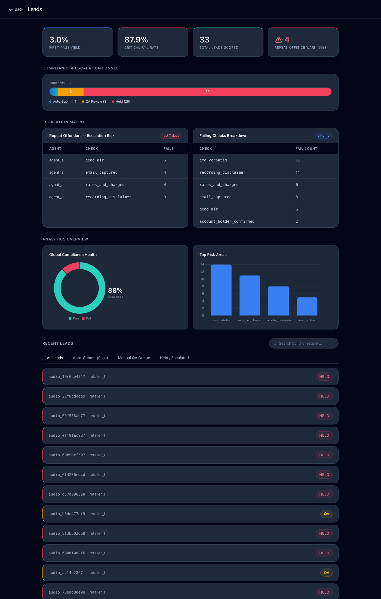
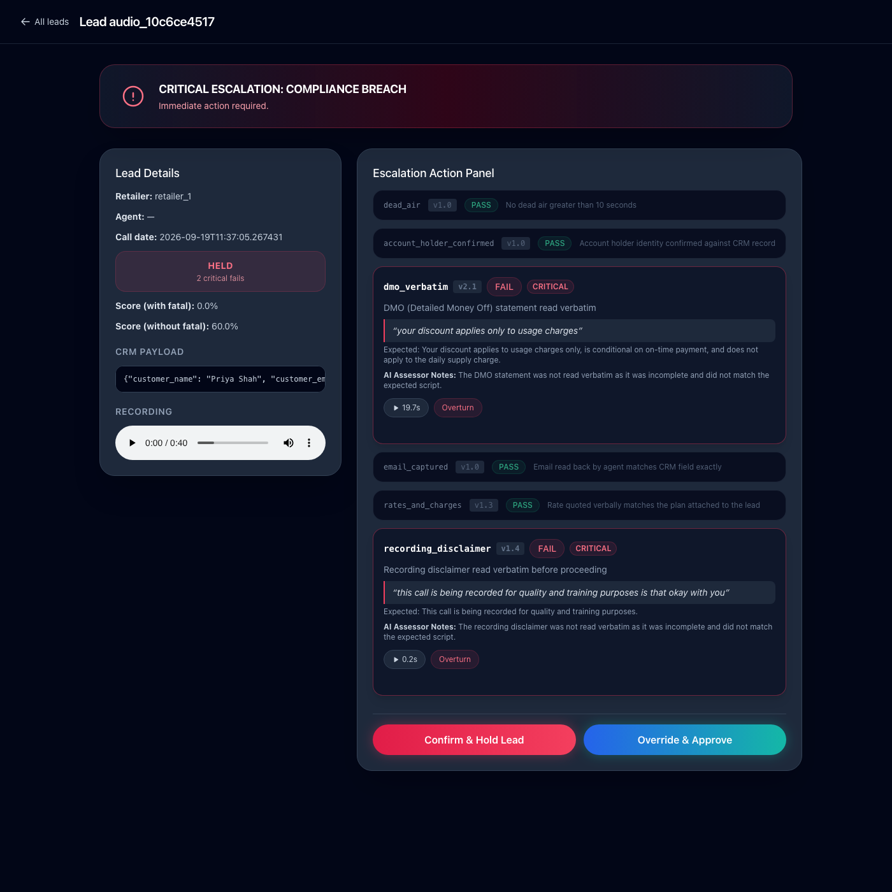
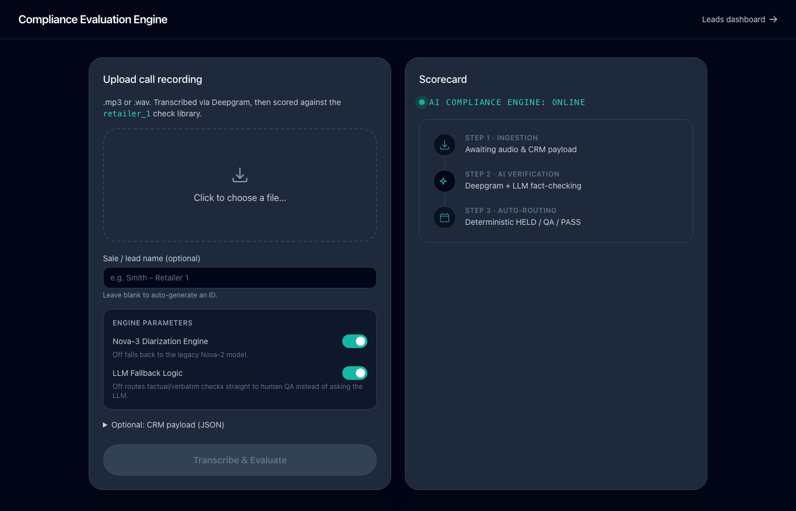

# Deterministic QA: AI-Powered Gate Logic

An automated CRM compliance engine for sales call centers. Upload a call recording (or a structured transcript), and the system transcribes it, extracts a verdict per compliance check, and **deterministically** routes the lead to `AUTO_SUBMIT`, `QA`, or `HELD` — no LLM ever makes the routing decision, only the evidence extraction.

See [HLD.md](HLD.md) for the full architecture writeup.

## Screenshots

**Leads dashboard** — KPIs, compliance/escalation funnel, repeat-offender risk matrix, and status-filtered lead list:



**Lead scorecard** — per-check PASS/FAIL/CRITICAL verdicts with exact transcript quotes, timestamps, check-version badges, and human overturn controls:



**Live evaluation demo** — drag-and-drop audio upload with real engine-parameter toggles (STT model, LLM fallback) and a live pipeline status view:



## Stack

- **Backend**: FastAPI + Uvicorn (async), SQLite via `aiosqlite`
- **Transcription**: Deepgram (`diarize`, `utterances`, `smart_format=False`)
- **Evaluation**: `instructor` + OpenAI for structured verbatim/factual checks; pure-Python deterministic detection for behavioural checks (e.g. dead air)
- **Frontend**: Server-rendered Jinja2 + vanilla JS + Tailwind CDN — no build step

## Running locally

```bash
pip install -r requirements.txt
# .env needs DEEPGRAM_API_KEY and OPENAI_API_KEY
uvicorn main:app --reload
```

Then open `http://127.0.0.1:8000/evaluate` to upload a call, or `http://127.0.0.1:8000/leads` for the dashboard.

## Key design principles

- **Deterministic-first, LLM-last**: the LLM only extracts a structured verdict per check; Python code (`apply_gate_logic`) decides the routing outcome.
- **No silent auto-pass**: missing API key, LLM/schema errors, or an operator-disabled LLM fallback all route to `LOW_CONFIDENCE` for human QA — never a free pass.
- **PCI redaction is not togglable**: card-number-shaped digit runs are stripped before storage or LLM exposure, unconditionally.
- **Data-driven checks**: gate logic and scoring are driven by `check_type`/`is_critical`/`weight` in the check-library JSON, not hardcoded check IDs.
